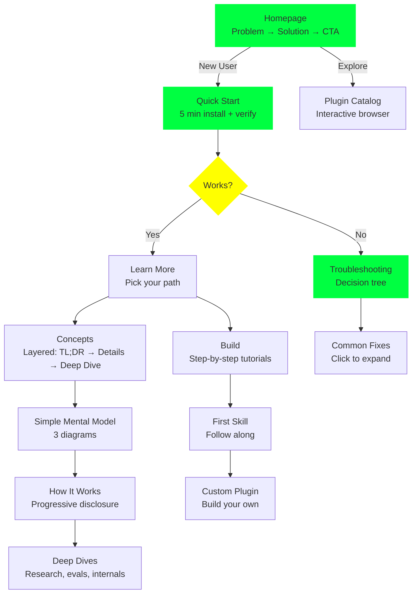
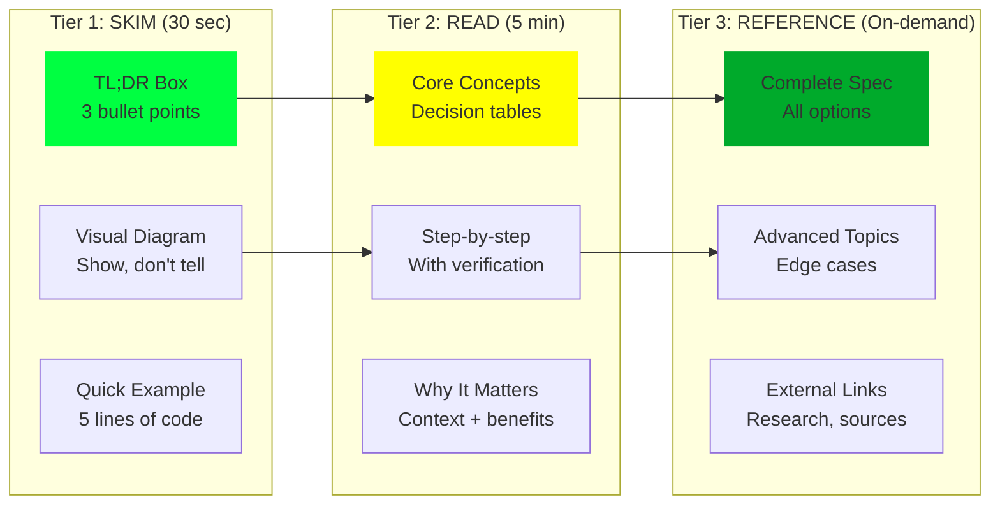
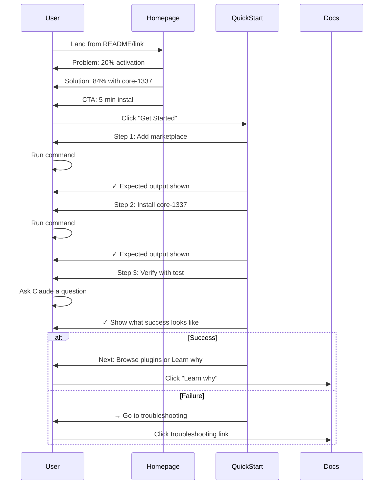

# Documentation Redesign Plan

## Current vs. Ideal Information Architecture

### Current Structure (Taxonomy-Driven)

```mermaid
graph TD
    Home[Homepage<br/>Boot + 3 links] --> Start[Start<br/>4 steps]
    Home --> Tutorials[Tutorials<br/>6 paths equal weight]
    Home --> HowTo[How-To<br/>Flat list of tasks]
    Home --> Explanation[Explanation<br/>5 deep dives]
    Home --> Reference[Reference<br/>Plugin specs]

    Explanation --> Arch[Architecture<br/>293 lines, all concepts]
    Explanation --> Activation[Activation<br/>Research study]
    Explanation --> Agents[Agents]
    Explanation --> Models[Models]
    Explanation --> Extend[Extensibility]

    style Home fill:#0a0e0a,stroke:#00ff41
    style Arch fill:#ff0055,stroke:#ff0055
    style Activation fill:#ff0055,stroke:#ff0055
```



**Problems:**
- No clear entry point for "I just heard about this"
- Architecture page dumps all concepts at once
- Repetition across Start, Explanation, Tutorials
- No troubleshooting path
- Mobile nav broken

---

### Ideal Structure (Journey-Driven)



**Benefits:**
- Clear entry point by user intent
- Progressive complexity (simple → detailed → deep)
- Troubleshooting is first-class
- Verification is explicit
- Path-driven navigation

---

## Progressive Disclosure Strategy

### Three Tiers of Content



**Application:**
- Every page starts with Tier 1
- Tier 2 expands on demand (or sequential scroll)
- Tier 3 is linked separately (collapsible or separate pages)

---

## New Homepage Structure

### Current Homepage
```
┌─────────────────────────────────┐
│ Header + Nav                    │
├─────────────────────────────────┤
│ Boot Sequence (animation)       │
│ > SYSTEM READY                  │
│ _                               │
├─────────────────────────────────┤
│ Tagline in box                  │
│ "Data-driven decisions..."      │
├─────────────────────────────────┤
│ ## Install                      │
│ /plugin marketplace add...      │
│                                 │
│ Quick start • Tutorials • Catalog│
├─────────────────────────────────┤
│ Footer                          │
└─────────────────────────────────┘
```

**Missing:** Context, value prop, problem statement

---

### Redesigned Homepage

```
┌─────────────────────────────────┐
│ Header + Nav                    │
├─────────────────────────────────┤
│ Boot Sequence (animation)       │
│ > SYSTEM READY                  │
│ _                               │
├─────────────────────────────────┤
│ ## The Problem                  │
│ Skills activate 20% of the time │
│ [Diagram showing activation]    │
├─────────────────────────────────┤
│ ## The Solution                 │
│ core-1337 → 84% activation      │
│ Best-in-class tools, not catalogs│
├─────────────────────────────────┤
│ ## Get Started                  │
│ [Primary CTA Button]            │
│ 5-minute install →              │
│                                 │
│ Or: Browse plugins | See why    │
├─────────────────────────────────┤
│ ## What You Get                 │
│ [3 columns]                     │
│ Core | Tools | Languages        │
├─────────────────────────────────┤
│ Footer                          │
└─────────────────────────────────┘
```

---

## User Journey Flows

### Journey 1: New User (Never Heard Of It)



---

### Journey 2: Existing User (Building Plugin)

```mermaid
sequenceDiagram
    participant User
    participant Catalog
    participant Tutorial
    participant Reference

    User->>Catalog: Browse existing plugins
    Catalog->>User: Show 6 plugins with examples
    User->>User: "I want to build python-1337"

    User->>Tutorial: Click "Build custom plugin"
    Tutorial->>User: Prerequisites checklist
    Tutorial->>User: Tier 1: TL;DR + diagram
    User->>User: "Got it, let's build"

    Tutorial->>User: Step 1-6 with verification
    User->>User: Follow along, test each step

    Tutorial->>User: Test activation (with expected output)
    User->>User: Run eval framework

    alt Activation < 80%
        Tutorial->>Reference: → How to improve descriptions
        Reference->>User: Decision framework + examples
        User->>Tutorial: Update and retest
    else Activation ≥ 80%
        Tutorial->>User: ✓ Ready to publish
        Tutorial->>User: Next: Add to marketplace
    end
```

---

## Content Layering Example: Architecture Page

### Current Architecture Page (Flat)
```
Line 1-60: What is a marketplace
Line 61-106: What are skills
Line 107-135: What are hooks
Line 136-165: What are commands
...
Line 272-286: How it all fits together
```

All concepts at same depth. No entry point for "just tell me how this works."

---

### Redesigned Architecture Page (Layered)

```
┌─────────────────────────────────────────┐
│ [TIER 1: 30 seconds]                    │
├─────────────────────────────────────────┤
│ ## TL;DR                                │
│ • Marketplace = collection of plugins   │
│ • Plugin = package of components        │
│ • Skill = knowledge loaded on-demand    │
│                                         │
│ [Diagram: User → Marketplace → Plugin   │
│            → Skill → Activation]        │
│                                         │
│ [Expand for how it works ↓]            │
└─────────────────────────────────────────┘

┌─────────────────────────────────────────┐
│ [TIER 2: 5 minutes]                     │
├─────────────────────────────────────────┤
│ ## How Skills Activate                  │
│ 1. You ask a question                   │
│ 2. Claude reads skill descriptions      │
│ 3. Claude activates matching skills     │
│ 4. Skill content loads (progressive)    │
│                                         │
│ [Decision table: When to use what]      │
│                                         │
│ [Expand for deep dive ↓]               │
└─────────────────────────────────────────┘

┌─────────────────────────────────────────┐
│ [TIER 3: Reference]                     │
├─────────────────────────────────────────┤
│ ## Complete Specifications              │
│ • Marketplace structure                 │
│ • Plugin metadata                       │
│ • Skill format                          │
│ • Hooks, commands, agents               │
│ • MCP integration                       │
│ • Eval framework                        │
│                                         │
│ [Links to detailed pages]               │
└─────────────────────────────────────────┘
```

---

## Visual Hierarchy Improvements

### Tags for Content Difficulty

```markdown
# [BEGINNER] Quick Start
Install and verify in 5 minutes

# [INTERMEDIATE] Custom Plugin Tutorial
Build python-1337 from scratch (30 min)

# [ADVANCED] MCP Integration
Connect external context servers
```

CSS:
```css
h1[id^="beginner"]::before {
  content: "[BEGINNER] ";
  color: var(--green);
  font-size: 0.7rem;
}

h1[id^="advanced"]::before {
  content: "[ADVANCED] ";
  color: var(--yellow);
  font-size: 0.7rem;
}
```

---

### Collapsible Sections

```markdown
## How Skills Activate

<details>
<summary><strong>Quick version (30 sec)</strong></summary>

Claude reads skill descriptions, activates matches, loads content on-demand.

[Simple diagram]
</details>

<details>
<summary><strong>Detailed explanation (5 min)</strong></summary>

[Full explanation with examples]
</details>

<details>
<summary><strong>Deep dive: Activation research</strong></summary>

[Link to /explanation/activation/]
</details>
```

---

### "Quick Wins" Boxes

```markdown
## terminal-1337

### ⚡ Quick Wins (80% of value)

| Tool | Replaces | Why Better |
|------|----------|------------|
| rg   | grep     | 10x faster, respects .gitignore |
| fd   | find     | Simpler syntax, smart defaults |
| bat  | cat      | Syntax highlighting, git integration |

**Install:** `/plugin install terminal-1337@claude-1337`

[See all 8 tools ↓]

---

## All Tools

[Complete reference with 8 tools]
```

---

## Terminology Standardization

### Find & Replace Across All Docs

| Replace This | With This | Reason |
|--------------|-----------|--------|
| "trigger a skill" | "activate a skill" | Consistent verb |
| "load a skill" | "activate a skill" | Same action |
| "invoke a skill" | "activate a skill" | Same action |
| "check skills" | "evaluate skills" | Technical term |
| "frontmatter" | "skill description (YAML frontmatter)" | Define on use |
| "progressive disclosure" | "on-demand loading" | Clearer for non-UX folks |
| "ground truth" | "observed tool invocation" | Define technical term |

---

## Implementation Plan

### Phase 1: Critical Fixes (2-3 hours)
1. ✅ Homepage: Add problem/solution/CTA structure
2. ✅ Quick start: Add verification with expected output
3. ✅ Create troubleshooting page with decision tree
4. ✅ Standardize terminology (find/replace)
5. ✅ Fix mobile navigation

### Phase 2: Progressive Disclosure (3-4 hours)
6. ✅ Restructure architecture page with 3 tiers
7. ✅ Add TL;DR boxes to all explanation pages
8. ✅ Add "Quick Wins" to reference pages
9. ✅ Create visual tags ([BEGINNER], [ADVANCED])
10. ✅ Add collapsible sections to long pages

### Phase 3: Content Improvements (2-3 hours)
11. ✅ Add prerequisites to all tutorials
12. ✅ Add verification steps with expected output
13. ✅ Create diagrams for key concepts
14. ✅ Group plugins by category in reference index
15. ✅ Add "What success looks like" examples

### Phase 4: Polish (1-2 hours)
16. ✅ Add breadcrumb paths
17. ✅ Create section breaks for visual rhythm
18. ✅ Improve mobile typography
19. ✅ Test all changes in production build
20. ✅ Update README with new structure

---

## Success Metrics

After redesign, a new user should be able to:

1. ✅ Understand what claude-1337 is in 30 seconds (homepage)
2. ✅ Install and verify in 5 minutes (quick start with verification)
3. ✅ Find help when stuck (troubleshooting decision tree)
4. ✅ Navigate on mobile (fixed navigation)
5. ✅ Understand architecture in 3 tiers (skim/read/reference)
6. ✅ Know if activation worked (expected output examples)
7. ✅ Find the right plugin (categorized catalog)

---

## Next Steps

1. Review and approve this plan
2. Start with Phase 1 (critical fixes)
3. Create diagrams for key concepts
4. Implement progressive disclosure
5. Test with fresh eyes
