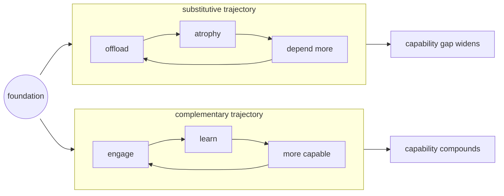

# ethos

What we're building toward and why it matters now.

---

## the goal

Extensions that make the collaboration **more capable** — human, AI, and system together.

After using a tool, nothing changes. After engaging with a cognitive extension, both collaborators understand something they didn't before. The human learns patterns and reasoning. Claude gains context and corrections. The system crystallizes knowledge for future sessions.

---

## the stakes

The foundations we establish now will compound — in either direction.

### the divergence dynamic

The gap isn't static. It accelerates from both sides:

**AI trajectory**: Capability increasing rapidly. Each generation more capable than the last.

**Human trajectories** (plural — they diverge):

| pattern | trajectory | outcome |
|---------|------------|---------|
| **complementary** | engage, learn, improve | capability accumulates |
| **substitutive** | offload, consume, depend | capability atrophies |

The research shows the slope:
- **Lancet (2025)**: 20% skill degradation in three months of AI exposure
- **MIT (2025)**: 83% of LLM users couldn't recall what they just wrote
- **Gerlich (2025)**: r = -0.75 correlation between AI use and critical thinking

These aren't plateau effects. They're slope indicators. And the slope steepens as dependency deepens.

### the compounding problem

Miscalibrated confidence masks the decline. METR (2025) found developers 19% slower with AI but perceiving themselves 20% faster. By the time you notice, the gap is substantial.

Each cycle raises or lowers the baseline. The trajectory is set by the pattern.

### why now

AI capability is increasing faster than our frameworks for using it well. Patterns established now become defaults. Good patterns compound toward enhancement. Bad patterns compound toward dependency.

---

## the research

Human-AI collaboration fails by default:

| study | finding | implication |
|-------|---------|-------------|
| **Vaccaro et al. (2024)** | Human-AI teams perform worse than best alone (g = -0.23) | synergy is rare |
| **Lee et al. (2025)** | Higher AI confidence predicts less critical thinking (β = -0.69) | trust without engagement hollows |
| **Doshi & Hauser (2024)** | Individual creativity up 8%, collective diversity down | homogenization risk at scale |

The mechanism: offload thinking → consume output → capability atrophies → can't tell it's happening.

---

## what determines outcome

From Blaurock et al. (2024), five design features matter:

| feature | effect | implication |
|---------|--------|-------------|
| **transparency** | strong positive | show reasoning, not just conclusions |
| **process control** | strong positive | user shapes how |
| **outcome control** | strong positive | user shapes what |
| **reciprocity** | strong positive | both improve through collaboration |
| **engagement** | weak/none | asking questions isn't enough |

The key insight: transparency and control enable enhancement. Mere engagement without them doesn't.

---

## three extension types

| type | what happens | trajectory |
|------|--------------|------------|
| **complementary** | human learns through collaboration | better with and without |
| **constitutive** | enables what was impossible | new capability emerges |
| **substitutive** | human just consumes output | capability atrophies |

Constitutive is valuable — AI enabling things humans couldn't do alone. The danger is substitutive: AI doing things humans *could* do, without the human learning anything.

The same extension can be either, depending on how it's designed and used.

---

## the principles

| principle | what it means | why it matters |
|-----------|---------------|----------------|
| **collaborative agency** | both parties retain judgment | compliance is brittle; understanding scales |
| **bidirectional learning** | both develop through collaboration | you grow, not just the system |
| **transparent abstractions** | readable, forkable, verifiable | if you can't see it, you can't learn from it |
| **composable architecture** | extensions build on each other | compound improvements, not reinvention |

These matter. Every extension that ships without transparency, control, and reciprocity built in is a small vote for the substitutive trajectory.

---

## for builders

Design for mutual enhancement:

- **Show reasoning** — visible thinking transfers to both collaborators
- **Provide frameworks** — decision frameworks, not decisions
- **Cite sources** — claims can be verified, trust can be calibrated
- **Make it readable** — readable extensions make learning available to both parties

The goal: after using your extension, the collaboration is more capable. One party gains context directly. The other can learn if they engage. The system crystallizes knowledge for next time.

---

## deeper

- [extended mind thesis](/explore/explanation/collaborative-intelligence/extended-mind/) — the theoretical foundation
- [research](/explore/reference/research/) — the empirical evidence
- [bibliography](/explore/reference/bibliography/) — full citations
- [design principles](/explore/explanation/principles/) — full explanation
