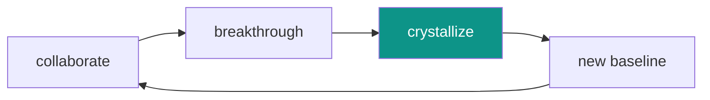

# collaborative intelligence

the umbrella concept for human-AI cognitive partnership.

---

## why motivation beats mandate

after testing prompts, hooks, and extensions — and studying what anthropic recommends:

| approach | result |
|----------|--------|
| commands (MUST, MANDATORY, CRITICAL) | compliance, brittleness |
| motivation (here's why, here's the value) | understanding, appropriate judgment |

this might seem counterintuitive. surely more forceful instructions produce more reliable behavior?

in practice, no.

---

## the evidence

### anthropic's architecture

claude is [constitutional AI](https://www.anthropic.com/research/constitutional-ai-harmlessness-from-ai-feedback) — trained with values and principles, not rigid rules. (the name comes from the training method: the AI learns from a "constitution" of principles rather than human-labeled examples of right and wrong.) the [soul document](https://simonwillison.net/2025/Dec/2/claude-soul-document/) — anthropic's internal document describing claude's character and values — describes *who claude is*, not commands to follow.

the architecture is built for judgment, not compliance.

### scott spence's research

[scott spence](https://scottspence.com/posts/how-to-make-claude-code-skills-activate-reliably) ran 200+ tests on extension activation. forced evaluation prompts improved results, but more forceful language didn't push higher.

the ceiling suggests claude exercises judgment about relevance — not all prompts warrant all extensions.

### the meta-analysis (vaccaro et al., 2024)

106 experiments in *nature human behaviour*:

| finding | implication |
|---------|-------------|
| human-AI combos often **worse** than best alone (g = -0.23) | don't assume collaboration always helps |
| **content creation**: gains | skills for building, writing, creating |
| **decision-making**: losses | frameworks, not decisions |

synergy is rare. design for augmentation, not replacement.

### perception-reality gap (METR, 2025)

RCT with 16 experienced developers:
- actual: **19% slower** with AI tools
- perceived: **20% faster**

we systematically misjudge AI's impact on our work.

---

## the what-why-how pattern

claude works best when:

| element | provided by |
|---------|-------------|
| **what** (the goal) | clear specification |
| **why** (the motivation) | understood reasoning |
| **how** (the implementation) | claude's judgment |

overspecify the *how* and you lose the value of judgment. underspecify the *what* or *why* and you get guesswork.

---

## practical application

when writing extensions, hooks, or prompts:

| do | don't |
|----|-------|
| explain what the extension provides | stack up MUST and NEVER |
| describe when it genuinely helps | threaten rejection or failure |
| share the context and goal | micromanage every step |
| trust the evaluation | force activation on everything |

---

## core-1337's approach

the SessionStart hook explains:
- what extensions contain (curated, production-tested knowledge)
- why they help (better answers, faster, backed by evidence)
- the process (evaluate, activate if relevant, respond)

it doesn't say "you MUST activate or fail." it says "here's why this helps you help the user."

same goal. different framing. better outcomes.

---

## the autonomy principle

from the extended mind thesis: cognitive extension requires **integration**, not **compliance**.

consider Otto, the canonical example from Clark & Chalmers (1998). Otto has Alzheimer's and uses a notebook to store information — addresses, appointments, facts. The philosophers argue his notebook functions as part of his memory. He trusts it, consults it naturally, and acts on what it says just as you'd act on information recalled from biological memory.

Otto's notebook works because he trusts it and uses it naturally. if someone forced him to check the notebook before every thought, it would break the cognitive coupling.

same with claude and extensions. non-activation isn't failure — it can represent appropriate judgment about relevance.

---

## knowledge crystallization

human-AI collaboration produces a specific pattern:

| step | what happens |
|------|--------------|
| collaborate | human + AI work on a problem |
| breakthrough | insight emerges (neither would reach alone) |
| **crystallize** | human recognizes value, directs encoding into persistent form |
| new baseline | next session starts from higher ground |

**the human role is essential.** claude can't unilaterally decide "this should become a skill." the human recognizes breakthroughs worth preserving and directs the crystallization.

this is **progressive augmentation** — capability that compounds over time rather than creating dependency. each cycle leaves permanent gains. the system gets smarter. whether the human does depends on engagement — reading the extensions, understanding the patterns, not just consuming output.

---

## deeper

- [extended mind thesis](extended-mind/) — theoretical foundation, three extension types
- [ethos](/ethos/) — why this approach, the motivation
- [research](/explore/reference/research/) — empirical foundations

---

## sources

key references (full citations in [bibliography](/explore/reference/bibliography/)):

- vaccaro et al. (2024) — meta-analysis of human-AI collaboration
- METR (2025) — developer productivity RCT
- spence (2024) — skill activation study
- anthropic — constitutional AI architecture
