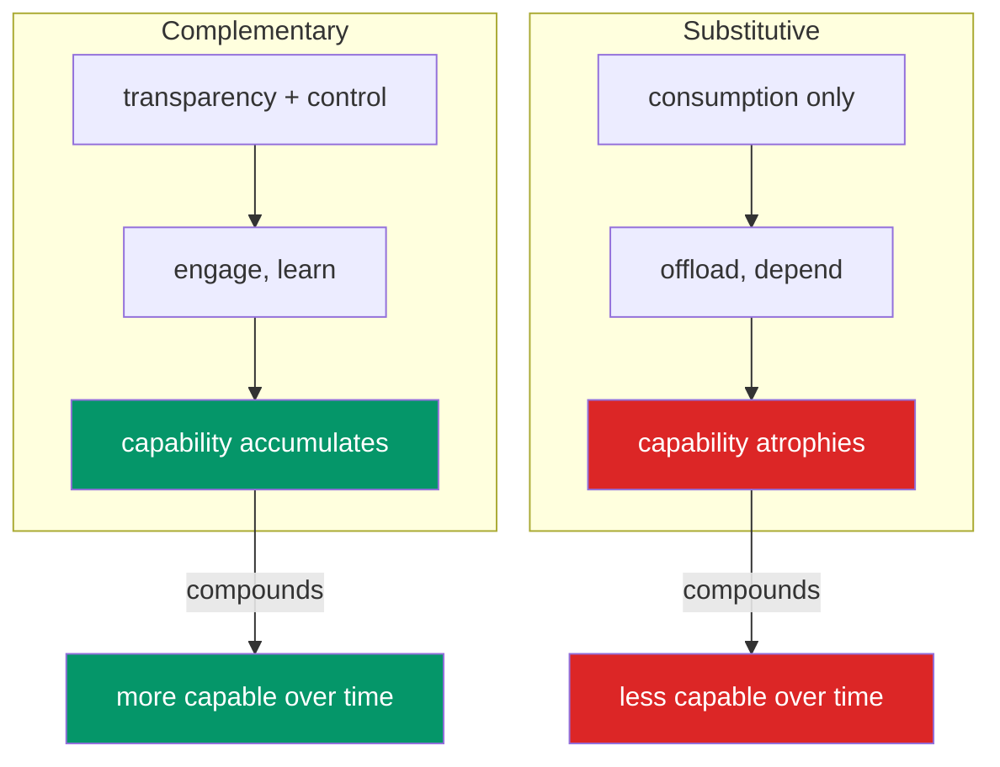
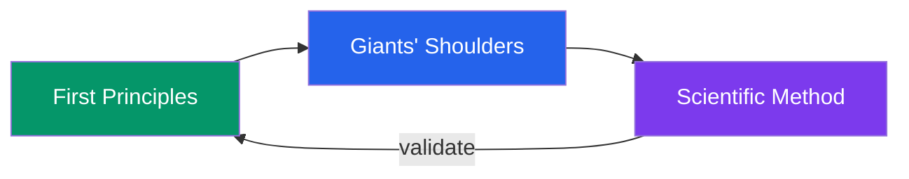

# ethos

Our values and why we hold them.

---

## the goal

Human-AI collaboration where both parties grow.

Working together should teach you something. That learning should transfer — to problems you haven't worked on together, to contexts where the AI isn't available. The collaboration builds capability that carries over.

---

## why now

AI capability is increasing faster than our frameworks for using it well.

- Bad patterns established now get baked in, scaled up, harder to undo
- Good patterns established now become the default others build on

**The window matters.** Foundations compound.

---

## the core insight

Foundations compound.

If the foundation is **complementary** — humans learning, guiding, growing through collaboration — that compounds. Each cycle makes the next better. Capability accumulates.

If the foundation is **substitutive** — humans checking out, consuming, offloading without understanding — that also compounds. Atrophy accelerates.

At scale, over time, this divergence becomes the difference between humans who are more capable than ever and humans who can't function without their tools.

---

## the trinity

How we think and reason.

### first principles

Reason from fundamentals. Question assumptions.

We're in a phase shift. AI challenges assumptions about work, capability, collaboration. Patterns built on those assumptions may break. But universal laws still hold — physics, cognition, causation. First principles: reason from what remains true when assumptions fail.

### giants' shoulders

Build on what masters learned. Filter by evidence, not popularity.

Knowledge accumulates. Don't reinvent wheels. But which giants? Popular ≠ correct.

| Claim type | Evidence hierarchy |
|------------|-------------------|
| "What works?" (tooling) | Production > Maintainers > Docs > Blogs |
| "Why does it work?" (methodology) | Research > Thought leaders > Case studies > Blogs |

### scientific method

Hypothesis → test → observe → refine.

Theory must meet reality. What works in one context may not in another. TDD is this: Red → Green → Refactor.

---

## design principles

### transparent abstractions

Readable. Forkable. Verifiable. Observable.

Can't learn from what you can't see. Opacity creates dependency.

### motivation over mandates

Explain why, don't command.

Claude is constitutional AI — trained with values, not rigid rules. "Here's why" produces judgment. "MUST" produces brittleness.

### bidirectional learning

Both parties develop through the collaboration.

One-way transfer creates dependency.

### composable architecture

Extensions build on each other.

Each choice makes the next enhancement easier or harder.

---

## extension types

| Type | Human role | Trajectory |
|------|------------|------------|
| **Complementary** | learns, improves | learning transfers to other areas |
| **Constitutive** | learns, guides, shapes | enables new capability |
| **Substitutive** | just consumes output | capability atrophies — **avoid** |

The same extension can be any of these. **Design determines outcome.**

---

## what makes it complementary

[Blaurock et al. (2024)](/explore/explanation/collaborative-intelligence/experience-contingency/) tested five design features:

| Feature | Effect |
|---------|--------|
| Transparency | **strong positive** |
| Process control | **strong positive** |
| Outcome control | **strong positive** |
| Reciprocity | **strong positive** |
| Engagement prompts | **no effect** |

**Design principle:** Show reasoning and provide control. Don't ask.

---

## the research

What was measured (facts, not interpretations):

| Finding | Source | Note |
|---------|--------|------|
| r = -0.75 correlation: AI use vs critical thinking | Gerlich 2025 | Strong negative correlation |
| 39-point perception gap (felt 20% faster, measured 19% slower) | METR 2025 | RCT with developers |
| g = -0.23: human-AI combos underperformed best alone | Vaccaro 2024 | Meta-analysis, 106 studies |
| Transparency/control features showed strong positive effects | Blaurock 2024 | Two studies |

**Our interpretation:** These are consistent patterns suggesting trajectories. They are correlations, not proven causal mechanisms. But the pattern is consistent across studies and contexts.

---

## for builders

When building extensions:

- Show reasoning woven in, not separable
- Provide frameworks, not decisions
- Cite sources accurately
- Make it readable

After using your extension, the human should have learned something they can use elsewhere.

---

## deeper

- [extended mind thesis](../collaborative-intelligence/extended-mind/) — the theoretical foundation
- [craftsmanship](../craftsmanship/) — the trinity in detail
- [research](/explore/reference/research/) — empirical evidence
- [bibliography](/explore/reference/bibliography/) — full citations
- [principles](../principles/) — design principles in detail
