# ethos

What we're building toward.

---

## the goal

Extensions that make the collaboration **more capable**.

A cognitive extension isn't a tool you pick up and put down — it becomes part of how you think. After using one, both parties understand something they didn't before.

---

## the divergence

Small design choices multiply their effects over time. Same technology, different trajectories.

```mermaid
flowchart LR
    U[use extension] --> D{design choice}
    D -->|transparency + control| C[complementary]
    D -->|consumption only| S[substitutive]
    C --> A1[engage, learn]
    S --> A2[offload, depend]
    A1 --> O1[capability accumulates]
    A2 --> O2[capability atrophies]

    style D fill:#374151,stroke:#6b7280
    style O1 fill:#059669,color:#fff
    style O2 fill:#dc2626,color:#fff
```

The evidence:

- **r = -0.75** correlation between AI use and critical thinking — a strong negative relationship where -1.0 would be perfect inverse correlation ([Gerlich 2025](/explore/reference/bibliography/#gerlich-2025))
- **20%** skill degradation in 3 months ([Lancet 2025](/explore/reference/bibliography/#lancet-2025))
- **39-point** perception gap — developers thought they were 20% faster, were 19% slower ([METR 2025](/explore/reference/bibliography/#metr-2025))

These aren't one-time drops that level out — they indicate ongoing decline.

---

## what determines outcome

Blaurock et al. (2024) tested five design features:

**Strong effect**: transparency, process control, outcome control, reciprocity.

**No effect**: engagement prompts (asking questions, prompting reflection).

Show reasoning and provide control. Don't ask.

---

## extension types

**Complementary** — human learns through collaboration. Better with and without the extension.

**Constitutive** — enables what was impossible alone. AI generating code at scale, searching patterns across millions of files.

**Substitutive** — human just consumes output without engagement. Capability atrophies.

The same extension can be any of these, depending on design.

---

## principles

**Collaborative agency** — both parties retain judgment.

**Bidirectional learning** — both parties develop through the collaboration.

**Transparent abstractions** — readable, forkable, verifiable.

**Composable architecture** — extensions build on each other.

---

## for builders

- Show reasoning woven in, not separable
- Provide frameworks, not decisions
- Cite sources
- Make it readable

After using your extension, the collaboration should be more capable.

---

## deeper

- [extended mind thesis](../collaborative-intelligence/extended-mind/) — the theoretical foundation
- [research](/explore/reference/research/) — empirical evidence
- [bibliography](/explore/reference/bibliography/) — full citations
- [principles](../principles/) — design principles in detail
