# Mermaid Diagram Types Reference

Complete catalog of Mermaid diagram types with production use cases and syntax patterns.

## Core Types (Stable, Widely Supported)

### sequenceDiagram
**Use when**: Object interactions over time, API calls, message flow

**Syntax**:
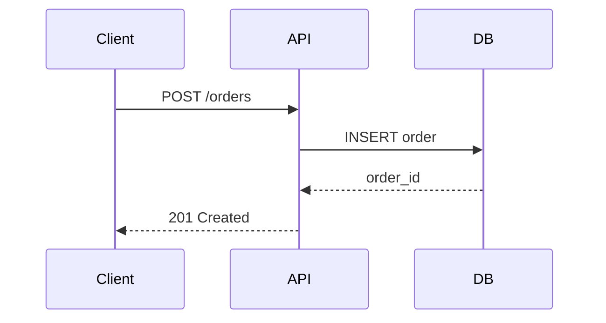

**Features**: Actors, lifelines, activation boxes, loops, alternatives, notes

**Production**: Kubernetes (control plane interactions), API documentation

### flowchart / graph
**Use when**: Process flow, algorithms, decision trees

**Syntax**:
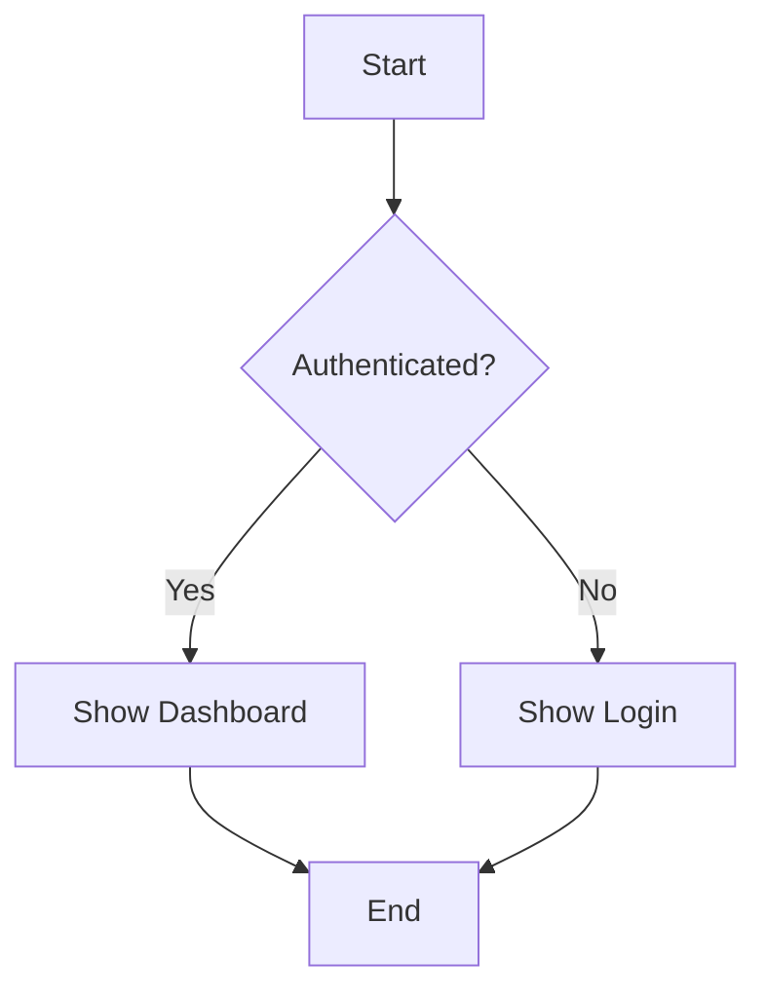

**Directions**: `TD` (top-down), `LR` (left-right), `BT`, `RL`

**Shapes**: Rectangle `[]`, Diamond `{}`, Circle `(())`, Hexagon `{{}}`

**Production**: Deployment pipelines, approval workflows

### stateDiagram-v2
**Use when**: State machines, entity lifecycles, workflow states

**Syntax**:
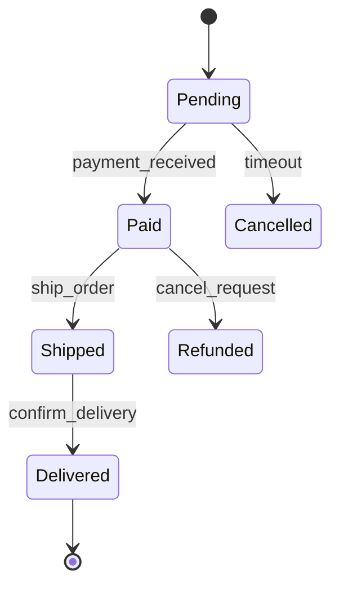

**Features**: States, transitions, composite states, concurrency

**Production**: Order management, deployment states, connection lifecycles

### erDiagram
**Use when**: Database schema, entity relationships, data models

**Syntax**:
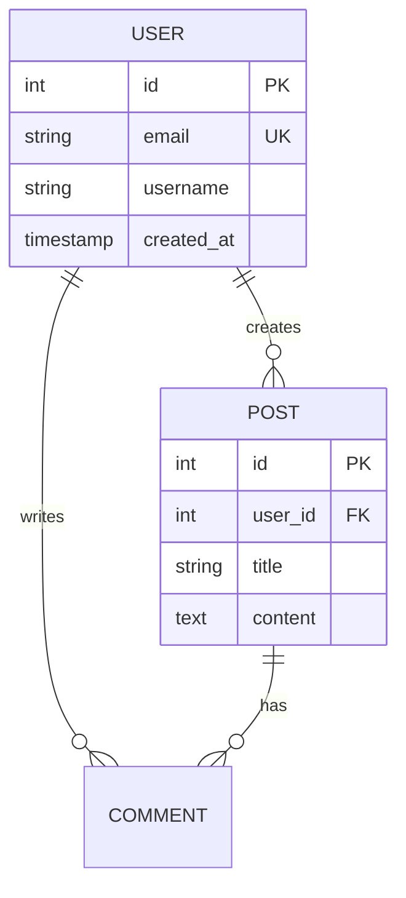

**Cardinality**: `||--o{` (one-to-many), `}o--o{` (many-to-many), `||--||` (one-to-one)

**Production**: API documentation, database design docs

### classDiagram
**Use when**: OOP structure, interfaces, inheritance

**Syntax**:
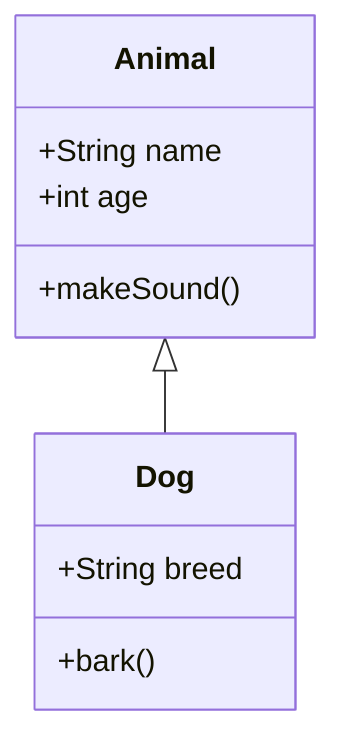

**Relationships**: Inheritance `<|--`, Composition `*--`, Aggregation `o--`, Association `-->`

**Production**: Codebase documentation, API design

### gantt
**Use when**: Project timelines, roadmaps, milestones

**Syntax**:
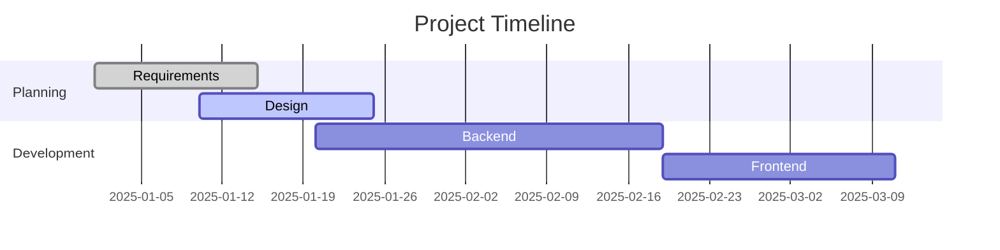

**Production**: Roadmaps, release planning

### pie
**Use when**: Proportional data, resource allocation

**Syntax**:
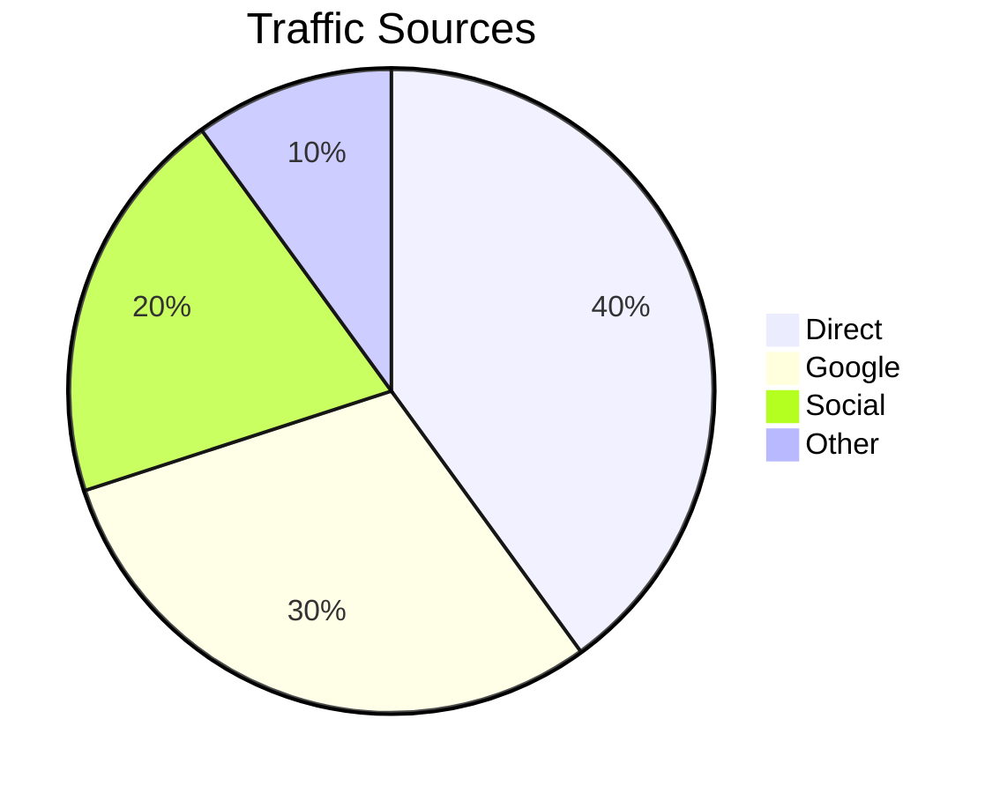

**Production**: Metrics dashboards, resource breakdown

### journey
**Use when**: User experience flows, customer journeys

**Syntax**:
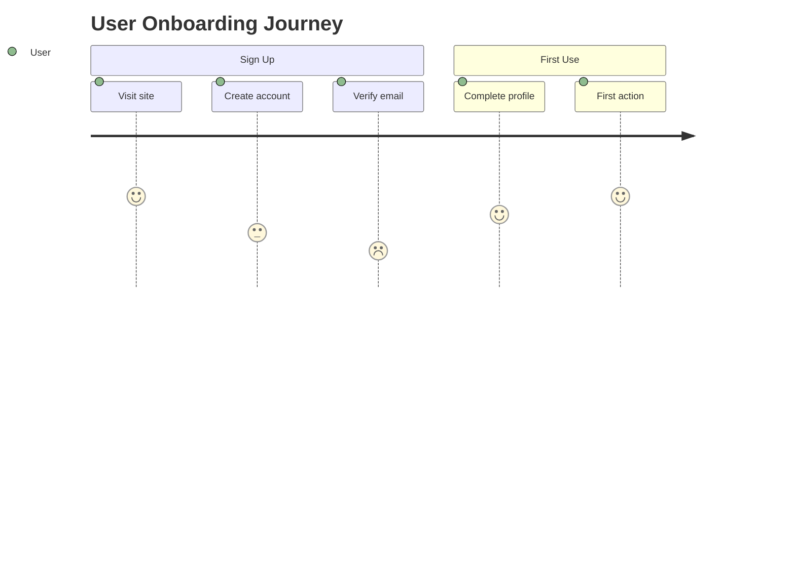

**Production**: UX documentation, customer experience mapping

## Recent Additions (Limited Platform Support)

### gitGraph
**Use when**: Git workflows, branching strategies, release processes

**Syntax**:
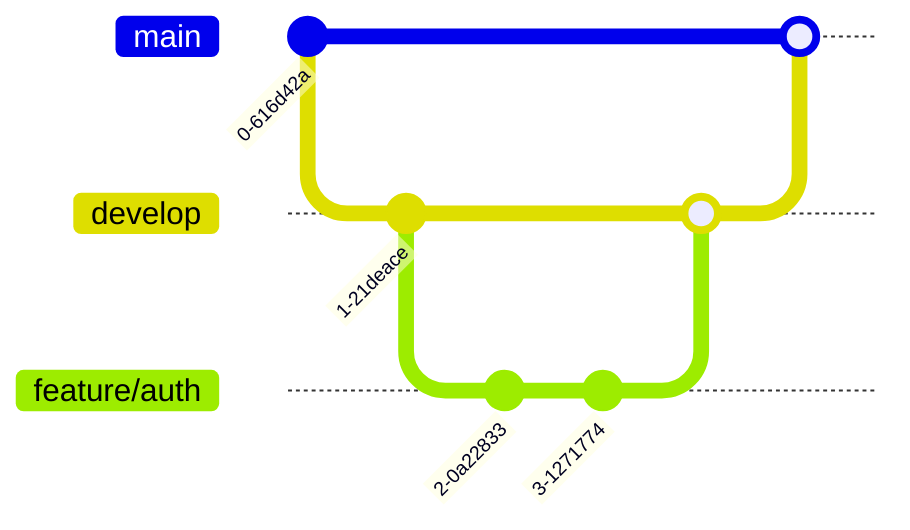

**Platform**: GitHub ~10.0.2 may not support. Verify on target platform.

**Production**: Git workflow documentation

### timeline
**Use when**: Chronological events, product history, migration phases

**Syntax**:
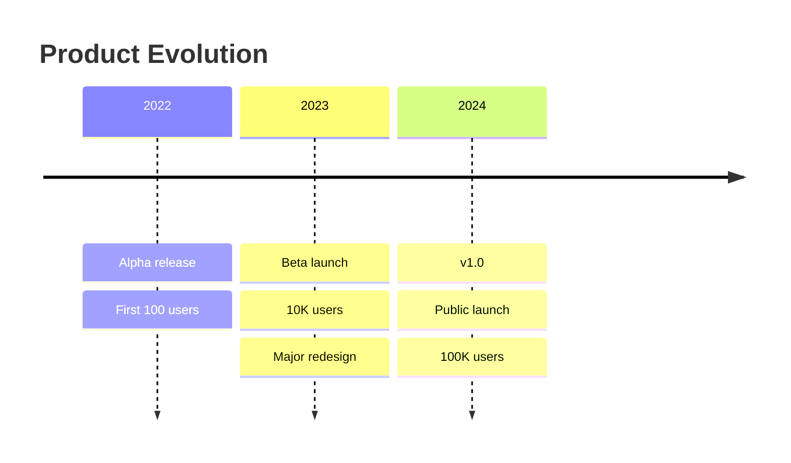

**Platform**: GitHub may not support. Test first.

### mindmap
**Use when**: Hierarchical concepts, knowledge organization, brainstorming

**Syntax**:
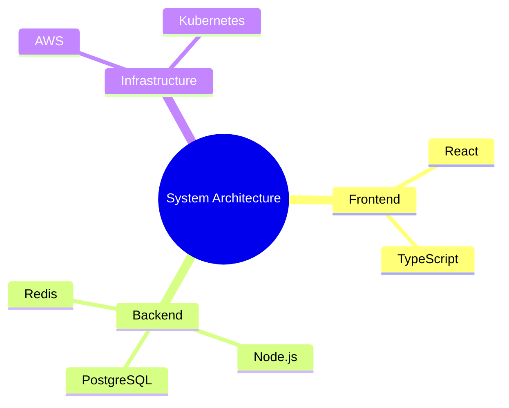

**Platform**: GitHub may not support. Test first.

### quadrantChart
**Use when**: 2D prioritization, effort/impact matrices

**Syntax**:
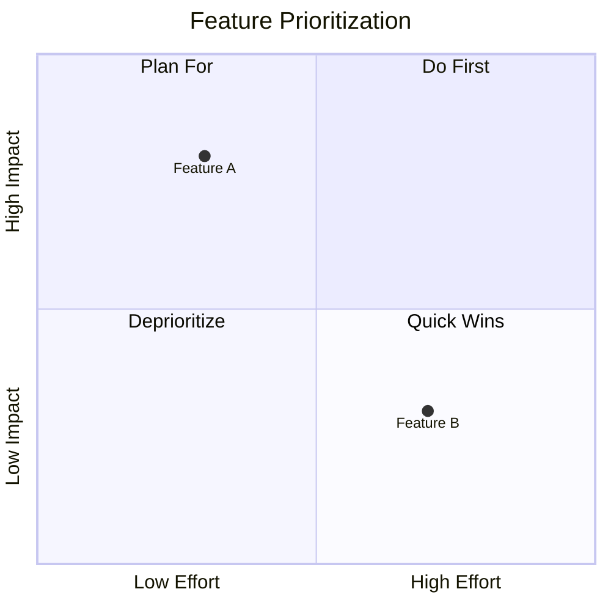

**Platform**: GitHub may not support. Test first.

### architecture-beta
**Use when**: Cloud/service architecture, microservices

**Syntax**:
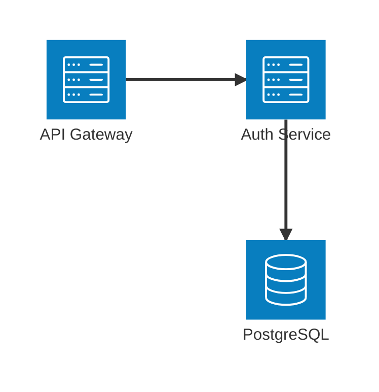

**Icons**: 200K+ from iconify.design

**Platform**: GitHub may not support. Use D2 for production if unavailable.

**Warning**: Non-deterministic rendering (can vary between loads)

### sankey
**Use when**: Flow visualization, traffic sources, resource allocation

**Syntax**:
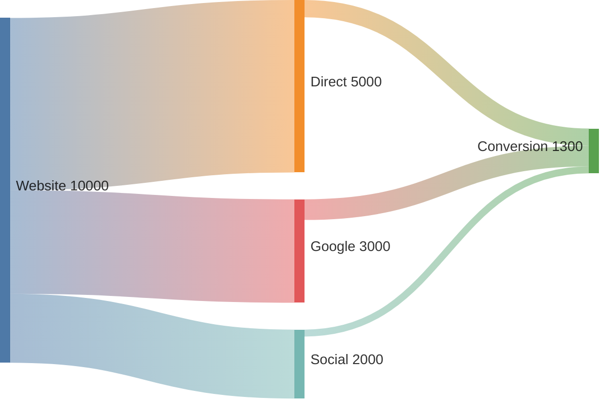

**Platform**: Very new. Test on target platform.

### kanban
**Use when**: Workflow visualization, task boards

**Syntax**:
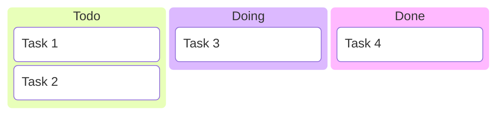

**Platform**: Very new. Test on target platform.

## Syntax Patterns

### Arrow Types by Diagram

| Diagram Type | Solid | Dotted | Comment |
|--------------|-------|--------|---------|
| Flowchart | `-->` | `-.->` | Direction matters |
| Sequence | `->>` | `-->>` | Message vs return |
| Class | `--` | `..` | Association vs dependency |
| State | `-->` | N/A | Transition arrows |
| ER | `--` | N/A | Relationship lines |

### Common Modifiers

- **Labels**: `A -->|label| B`
- **Styling**: `style A fill:#f9f,stroke:#333`
- **Classes**: `class A,B important` (with `classDef important fill:#f00`)
- **Notes**: `note right of A: This is a note`
- **Subgraphs**: Group related nodes

## Version Compatibility

| Platform | Version | Core Types | New Types |
|----------|---------|------------|-----------|
| GitHub | ~10.0.2 | ✅ All | ⚠️ Limited |
| GitLab | 10.6.0 | ✅ All | ⚠️ Some |
| Official | 11.x+ | ✅ All | ✅ All |

**Test diagrams on target platform before production deployment.**

---

**Sources**: Mermaid official docs (mermaid.js.org), Kubernetes diagram guide, GitLab handbook
