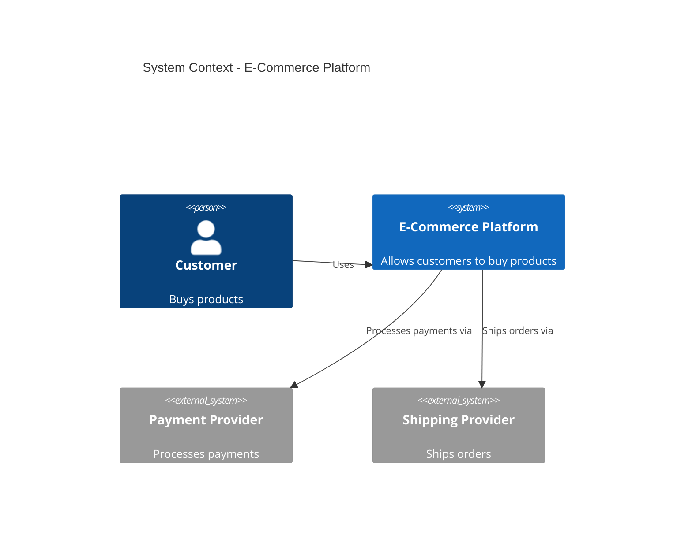
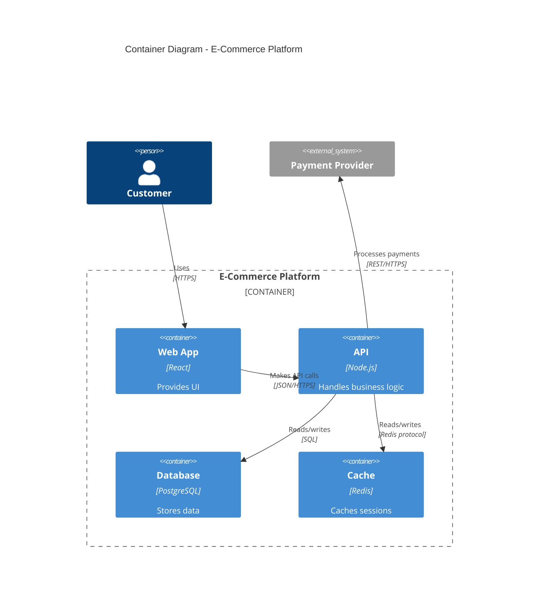

# C4 Model for Architecture Diagrams

C4 (Context, Container, Component, Code) model for software architecture documentation.

## THE Answer for Architecture Diagrams

**C4 Context**: System boundary, users, external systems (Level 1)
**C4 Container**: High-level tech choices, communication (Level 2)
**C4 Component**: Components within container (Level 3)
**C4 Code**: Class/interface level (Level 4)

**Guidance**: Most teams only need Context + Container diagrams.

## Level Selection

| Level | Audience | Shows | Tool Choice |
|-------|----------|-------|-------------|
| **Context** | Everyone (business + tech) | System boundary, users, external systems | Mermaid `c4Context` (simple) or C4-PlantUML |
| **Container** | Technical stakeholders | Apps, databases, communication | Mermaid `c4Container` or C4-PlantUML |
| **Component** | Developers | Components within container | C4-PlantUML (Mermaid less suitable) |
| **Code** | Developers (specific module) | Classes, interfaces | UML `classDiagram` or IDE |

## Mermaid C4 Syntax

### Context Diagram (Level 1)


**Shows**: What the system does, who uses it, what it integrates with

### Container Diagram (Level 2)


**Shows**: High-level technology choices, how containers communicate

## C4-PlantUML (For Serious C4 Work)

**Why**: Production-proven, automatic layout, standardized sprites, better for complex diagrams

**Installation**:
```bash
# Requires Java + GraphViz
brew install plantuml graphviz
```

**Syntax**:
```plantuml
@startuml
!include https://raw.githubusercontent.com/plantuml-stdlib/C4-PlantUML/master/C4_Context.puml

LAYOUT_WITH_LEGEND()

title System Context - E-Commerce Platform

Person(customer, "Customer", "Buys products")
System(ecommerce, "E-Commerce Platform", "Web and mobile apps")
System_Ext(payment, "Payment Provider", "Stripe")
System_Ext(shipping, "Shipping Provider", "FedEx")

Rel(customer, ecommerce, "Uses")
Rel(ecommerce, payment, "Processes payments")
Rel(ecommerce, shipping, "Ships orders")
@enduml
```

**Features**:
- Sprites (icons from iconify)
- Automatic layout
- Standardized styling
- Enterprise-proven

## When to Use C4 vs Other Diagrams

| Need | Use C4 | Use Instead |
|------|--------|-------------|
| Show system boundary | ✅ Context | Architecture diagram |
| Show tech stack | ✅ Container | Architecture diagram |
| Show component details | ✅ Component | Class diagram |
| Show API interactions | ❌ | Sequence diagram |
| Show state transitions | ❌ | State diagram |
| Show data model | ❌ | ER diagram |

**C4 is for structure, not behavior.**

## C4 Best Practices

### Keep It Focused
- **One system per Context diagram** - don't try to show everything
- **One container per Container diagram** - drill down into specific parts
- **Skip levels you don't need** - Context + Container often sufficient

### Meaningful Names
- **System names**: What it does ("Payment Service" not "Service A")
- **Container names**: Technology + purpose ("React Web App", "Node.js API")
- **Relationship labels**: What happens ("Processes payments", not "Uses")

### Audience-Appropriate Detail
- **Context**: Business stakeholders can understand
- **Container**: Technical leads can deploy
- **Component**: Developers can implement
- **Code**: Developers can navigate

### Update Regularly
- C4 diagrams live in git alongside code
- Update when architecture changes
- Use version control for diagram source
- Automate rendering in CI/CD

## C4 with Mermaid vs PlantUML

### Mermaid C4
**Pros**:
- Native GitHub/GitLab rendering
- Zero build step
- Quick for simple diagrams

**Cons**:
- Limited styling
- No sprites
- Component diagrams awkward

**Use when**: Simple Context/Container diagrams in GitHub docs

### C4-PlantUML
**Pros**:
- Production-proven (LINE, many enterprises)
- Automatic layout
- Sprites for standardized icons
- Better for complex diagrams

**Cons**:
- Requires Java + GraphViz
- No native GitHub rendering
- Build step required

**Use when**: Serious architecture documentation, complex systems, enterprise standards

## Alternative: D2 for Architecture

D2 can approximate C4 with manual grouping:
```d2
title: System Architecture (C4 Container-style)

users: Users {
  shape: person
}

cloud: Production System {
  web: Web App (React) {
    shape: rectangle
  }
  api: API (Node.js) {
    shape: rectangle
  }
  db: Database (PostgreSQL) {
    shape: cylinder
  }
}

payment: Payment Provider {
  shape: cloud
}

users -> web: Uses (HTTPS)
web -> api: API calls (JSON)
api -> db: Queries (SQL)
api -> payment: Processes payments (REST)
```

**Trade-off**: D2 has better layouts but requires build step and isn't "true" C4.

## Decision Matrix

| Situation | Tool Choice |
|-----------|-------------|
| Quick GitHub docs, simple architecture | Mermaid `c4Context` / `c4Container` |
| Complex enterprise architecture | C4-PlantUML |
| Need beautiful layouts, willing to build | D2 (C4-inspired, not strict C4) |
| Component-level documentation | C4-PlantUML Component or UML `classDiagram` |
| Formal C4 compliance required | C4-PlantUML |

## C4 Model Resources

**Official**: c4model.com - Simon Brown's original specification
**C4-PlantUML**: github.com/plantuml-stdlib/C4-PlantUML - Production-ready library
**Structurizr**: Paid service, DSL-based, exports to multiple formats

---

**Sources**: C4 model official docs (c4model.com), C4-PlantUML documentation, LINE Engineering blog, production architecture examples
